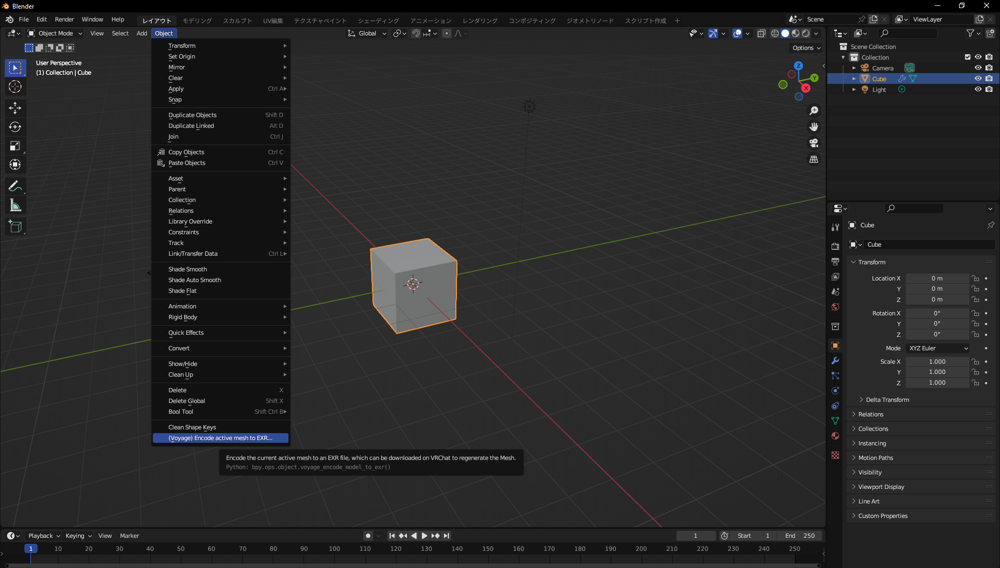
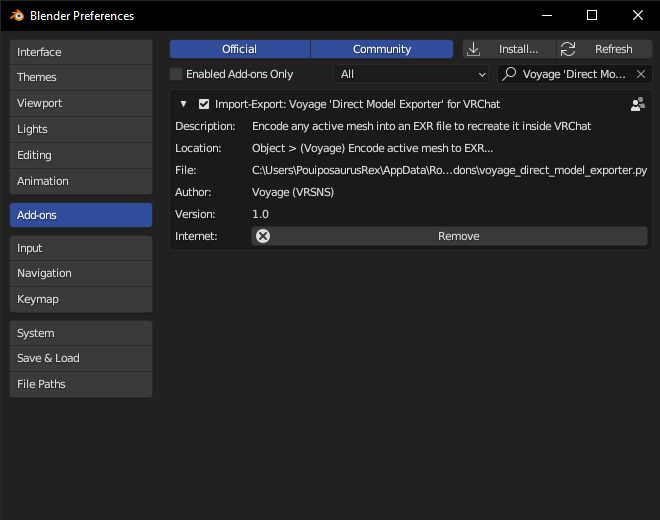

# Voyage Direct Model Exporter

To be used with the [Direct Model Importer for VRChat](https://github.com/vr-voyage/direct-model-importer-vrchat)

## How to export a Mesh

To export a Mesh with the Addon, select an object and select the menu item :
**Object > (Voyage) Encode active mesh to EXR...**

Then choose where you want to save the resulting EXR file.

Once the file generated, if you want to use it on VRChat, you'll have to upload
it on a webserver reachable through VRChat.
Since Discord file links are accepted and whitelisted by default, I recommend
uploading the file to your private Discord server, and then paste the link
in the VRChat 'Direct Model Importer' panel.

## How to install the Add-on

To install it, just download the latest release, then add it
to your addons in Blender.

* Open Blender
* Go to 'Edit > Preferences'
* Click on the 'Addons' tab on the left of the Preferences Window
* Click on the 'Install' at the upper-right of the Preferences Window
* Select the ZIP file you downloaded
* Check the box next to **Import-Export: Voyage 'Direct Model Exporter' for VRChat**
* Then close the Preferences Window

